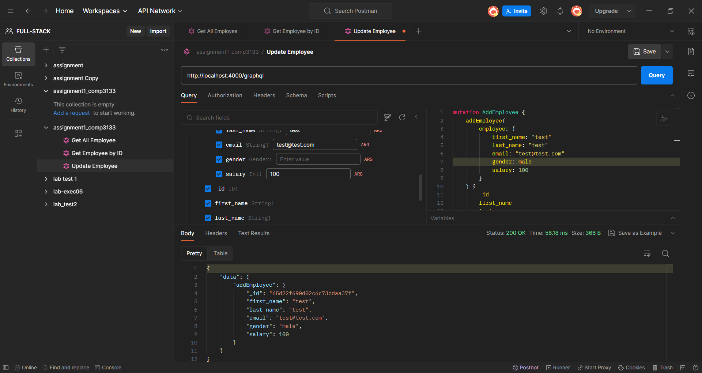
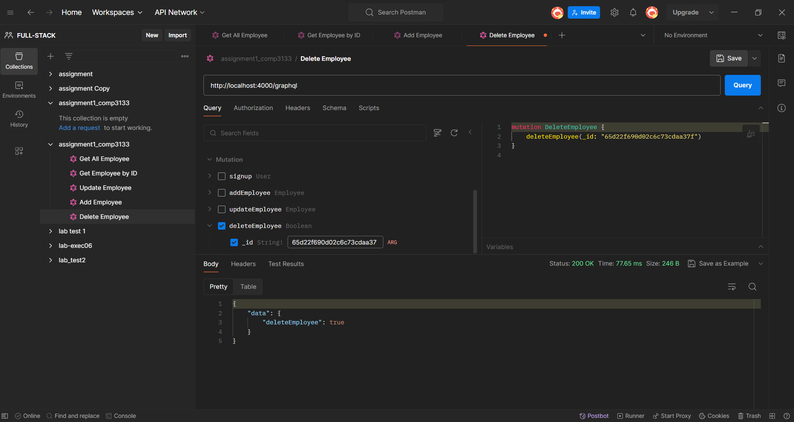
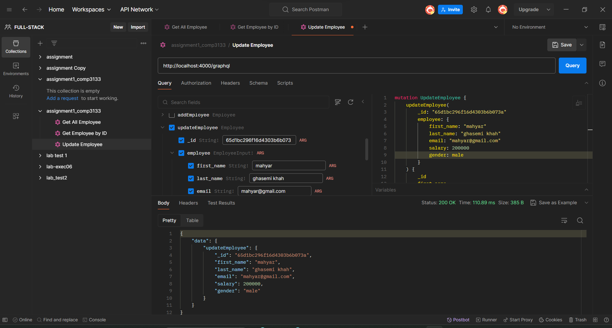
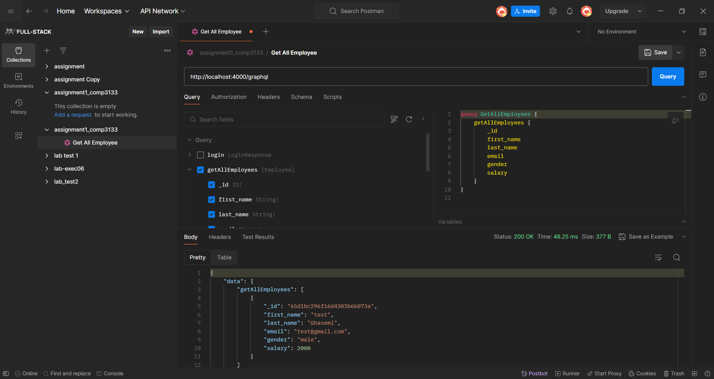
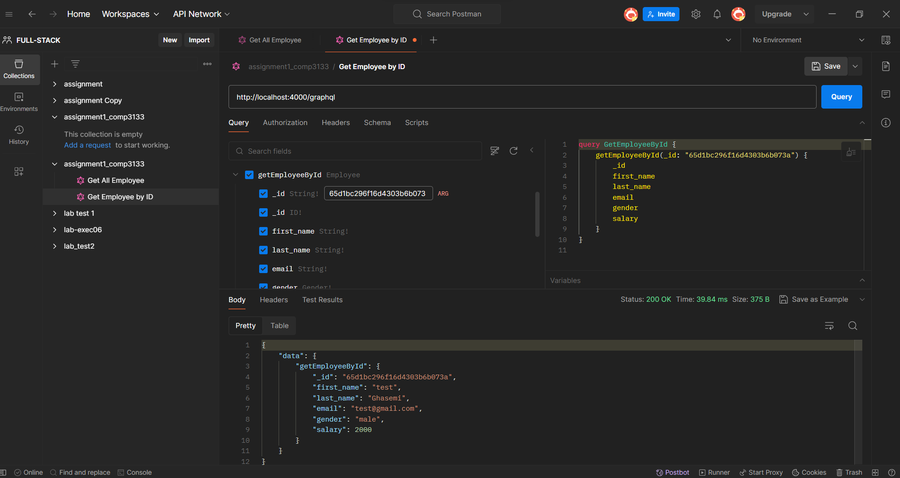
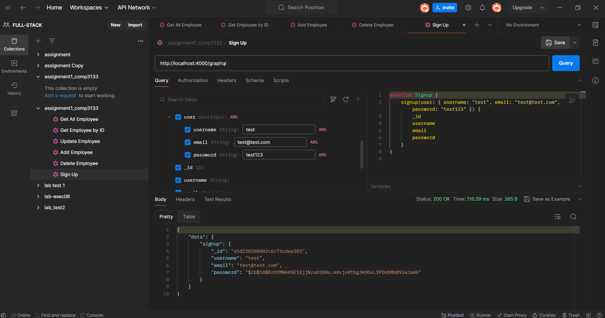
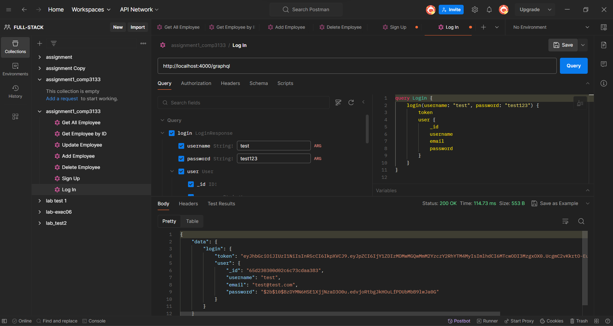
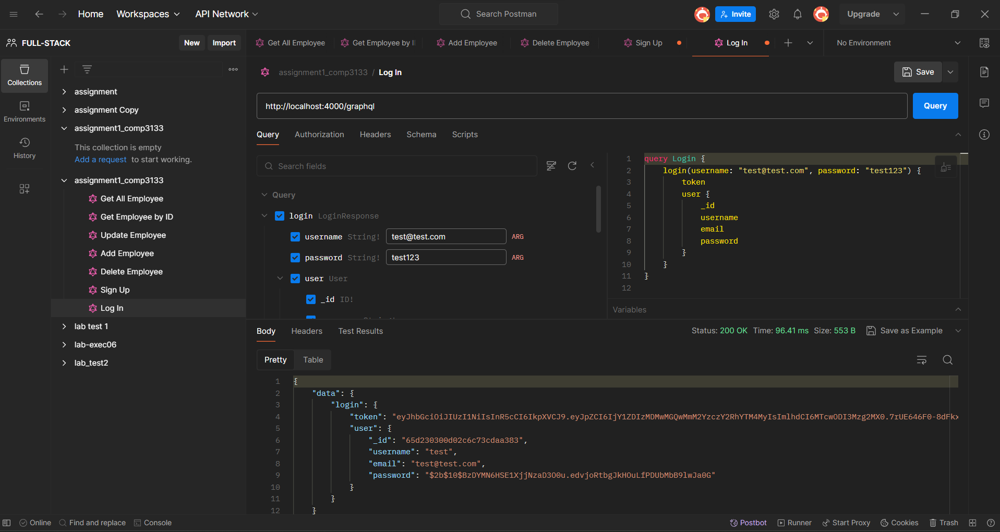

# 101399392_COMP3133_Assignment1

## Assignment 1

As a newly hired Jr. Software Engineer, I was tasked by my manager to develop a backend application using Node.js, Express, GraphQL, and MongoDB. This project aims to create a robust and scalable backend infrastructure to support various frontend applications and provide efficient data management capabilities.

## Features

- **User Authentication**: Users can sign up and log in to the application using their username/email and password. The application uses JWT for authentication and authorization.
- **Employee Management**: Users can create, read, update, and delete employee records. The application uses GraphQL to manage employee data.

## Technologies

- **Node.js**
- **Express**
- **GraphQL**
- **Apollo Server**
- **MongoDB**
- **Mongoose**
- **JWT**
- **Bcrypt**

## Installation

1. Clone the repository
2. Install the dependencies
3. Create a `.env` file and add the following environment variables:

```
REACT_APP_CONECTION_STRING=your_mongodb_uri
REACT_APP_JWT_SECRET=your_jwt_secret
```

4. Run the application

```bash
npm start # yarn start
# or
npm run dev
```

## Usage

Run the application and visit `http://localhost:4000/graphql`.

## Images









